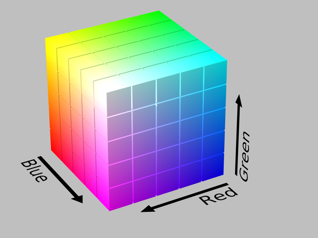
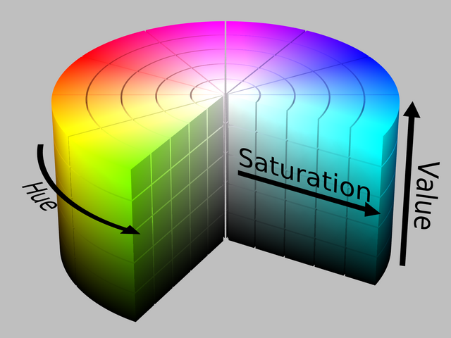
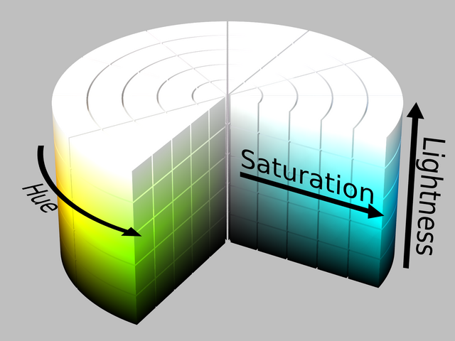

The Image class
---------------

Description
^^^^^^^^^^^

An image is stored in an :py:class:`Image <equimage.image.Image>` object as ``Image.image``, a :py:class:`numpy.ndarray` with data type :py:class:`numpy.float32` (single precision 32 bits floats) or :py:class:`numpy.float64` (double precision 64 bits floats):

  - Color images are represented as arrays with shape (3, H, W), where W is the width and H the height of the image in pixels. The leading axis spans the color channels (see `colormodel` below).
  - Grayscale images are represented as arrays with shape (1, H, W).

.. note::
  This convention differs from the usual representation of images as arrays with shape (H, W, 3) or (H, W). It is, however, more convenient to represent an image as such a superposition of "layers" or "channels" for many operations.

The :py:class:`Image <equimage.image.Image>` class also embeds ``Image.colorspace`` and ``Image.colormodel`` attributes for the color space and model of the image. The `colorspace` attribute can be:

  - "lRGB" for the linear RGB (lRGB) color space.
  - "sRGB" for the `sRGB <https://en.wikipedia.org/wiki/SRGB>`_ color space.
  - "CIELab" for the `CIELab <https://en.wikipedia.org/wiki/CIELAB_color_space>`_ color space.
  - "CIELuv" for the `CIELuv <https://en.wikipedia.org/wiki/CIELUV>`_ color space.

In the lRGB and sRGB color spaces, the `colormodel` attribute can be:

  - "gray": grayscale image with one single channel within [0, 1].
  - "RGB": the 3 channels of the image are the red, blue, and green levels within [0, 1].
  - "HSV": the 3 channels of the image are the `HSV hue, saturation and value <https://en.wikipedia.org/wiki/HSL_and_HSV>`_ within [0, 1].
  - "HSL": the 3 channels of the image are the `HSL hue, saturation and lightness <https://en.wikipedia.org/wiki/HSL_and_HSV>`_ within [0, 1].

In the CIELab color space, the `colormodel` attribute can be:

  - "Lab": the 3 channels of the image are the CIELab components :math:`L^*/100`, :math:`a^*/100`, and :math:`b^*/100`. The lightness :math:`L^*/100` fits within [0, 1], but the chromatic components :math:`a^*` and :math:`b^*` are signed and not (univocally) bounded.
  - "Lch": the 3 channels of the image are the CIELab components :math:`L^*/100`, :math:`c^*/100` and :math:`h^*/2\pi`. The lightness :math:`L^*/100` and the reduced hue angle :math:`h^*/2\pi=\arctan_2(b^*, a^*)/2\pi` fit within [0, 1], but the chroma :math:`c^*=\sqrt{a^{*2}+b^{*2}}` is not bounded.

In the CIELuv color space, the `colormodel` attribute can be:

  - "Luv": the 3 channels of the image are the CIELuv components :math:`L^*/100`, :math:`u^*/100`, and :math:`v^*/100`. The lightness :math:`L^*/100` fits within [0, 1], but the chromatic components :math:`u^*` and :math:`v^*` are signed and not (univocally) bounded.
  - "Lch": the 3 channels of the image are the CIELuv components :math:`L^*/100`, :math:`c^*/100` and :math:`h^*/2\pi`. The lightness :math:`L^*/100` and the reduced hue angle :math:`h^*/2\pi=\arctan_2(v^*, u^*)/2\pi` fit within [0, 1], but the chroma :math:`c^*=\sqrt{u^{*2}+v^{*2}}` is not bounded.
  - "Lsh": the 3 channels of the image are the CIELuv components :math:`L^*/100`, :math:`s^*/100` and :math:`h^*/2\pi`. The lightness :math:`L^*/100` and the reduced hue angle :math:`h^*/2\pi=\arctan_2(v^*, u^*)/2\pi` fit within [0, 1], but the saturation :math:`s^* = c^*/L^*` is not bounded.

The default color space of an image is "sRGB" and the default color model is "RGB". **You won't need to worry about the color space and model of your images for most operations**. See the section `More about color spaces and models`_ as well as :doc:`composite` for details.

The data type of the images (:py:class:`numpy.float32` or :py:class:`numpy.float64`) can be set globally with :py:func:`equimagelab.params.set_image_type() <equimage.params.set_image_type>` and inquired with :py:func:`equimagelab.params.get_image_type() <equimage.params.get_image_type>`. The :py:class:`numpy.float64` type is more accurate, but doubles the memory footprint of the images and can increase computation times. The default data type is :py:class:`numpy.float32`. Note that some operations (image scaling, edition with external software...) are performed with :py:class:`numpy.float32` or even :py:class:`numpy.int16` precision whatever the choice of data type for the images.

Creating and accessing images
^^^^^^^^^^^^^^^^^^^^^^^^^^^^^

An existing image represented as a :py:class:`numpy.ndarray` array `imgarray` can be embedded in an :py:class:`Image <equimage.image.Image>` object using the constructor ``image = Image(imgarray)``. You can specify the channel axis for color images [e.g., ``image = Image(imgarray, channels = -1)`` if `imgarray` has shape (H, W, 3) instead of the default shape (3, H, W)].

The :py:class:`Image <equimage.image.Image>` class behaves as a :py:class:`numpy.ndarray` for basic and Numpy operations. Namely, you can add, substract, multiply :py:class:`Image <equimage.image.Image>` objects, and apply all Numpy functions:

.. code-block:: ipython3

  image = (image1+image2)/2
  maxRGB = np.max(image, axis = (1, 2)) # Maximum R/G/B levels.
  fancy = np.sin(image) # For fun...

Therefore, you won't need to access the ``Image.image`` data for most purposes. If you need to do so anyway, we recommend that you use the :py:meth:`Image.get_image() <equimage.image.Image.get_image>` method, which returns the data as a :py:class:`numpy.ndarray` with shape (H, W, 3) or (3, H, W) (see the `channels` kwarg).

.. warning::

  By default the :py:meth:`Image.get_image() <equimage.image.Image.get_image>` method returns (if possible) a **view** on the ``Image.image`` data. Therefore, the instructions

  .. code-block:: ipython3

    data = image.get_image()
    data[0] *= 0.9 # Multiply the red channel by 0.9 to adjust color balance.

  modify both the `data` array and the original `image` object. Use ``data = image.get_image(copy = True)`` if you wish a **copy** of the image data.

You can also access the image as ``Image[:]`` (which returns a view on ``Image.image``), and specific channels of the image as, e.g., ``Image[0]`` (which returns a view on ``Image.image[0,:,:]``, the red channel for RGB images).

You can inquire about the size, number of channels, color space and model of an image with the following methods of the :py:class:`Image <equimage.image.Image>` class:

.. currentmodule:: equimage.image.Image

.. autosummary::

   get_shape
   get_size
   get_nc
   get_color_space
   get_color_model

You can make a copy of an :py:class:`Image <equimage.image.Image>` object with the method:

.. autosummary::

   copy

Loading and saving images
^^^^^^^^^^^^^^^^^^^^^^^^^

Images can be loaded from/saved on disk with the functions:

.. currentmodule:: equimage.image_io

.. autosummary::

   load_image
   save_image

eQuimageLab can handle png, tiff and fits files.

The image in an :py:class:`Image <equimage.image.Image>` object can also be saved with the method :py:class:`Image.save <equimage.image_io.MixinImage.save>`.

More about color spaces and models
^^^^^^^^^^^^^^^^^^^^^^^^^^^^^^^^^^

The lRGB and sRGB color spaces
""""""""""""""""""""""""""""""

In the linear RGB (lRGB) color space, the intensity of light is directly proportional to the RGB values of a pixel. This is usually the color space of the raw images, because cameras are, in principle, rather linear light detectors.

However, our eyes and brain act as a non-linear light detector. We are more sensitive (able to discern contrast) at low than at high intensities. Therefore, the lRGB color space does not look linear to us (namely, a green pixel with a value of 0.5 does not appear five times brighter than a green pixel with a value of 0.1). This can complicate the processing of lRGB images.

Therefore, screens, printers, etc... make use of a non-linear color space (where the intensity is not proportional to the RGB values). The "standard" on most screens and on the web is the `sRGB <https://en.wikipedia.org/wiki/SRGB>`_ color space. The relations between the lRGB and sRGB levels define the so-called transfer function or "gamma":

.. math::

  l &= \left(\frac{s+0.055}{1.055}\right)^{2.4}\text{ if }s > 0.04045\text{ else }\frac{s}{12.92}

  s &= 1.055l^{1/2.4}-0.055\text{ if }l > 0.0031308\text{ else }12.92l

where :math:`l \in [0, 1]` is a linear R, G, or B component and :math:`s` is the corresponding sRGB component.

The sRGB color space appears more linear to the eyes (a green pixel with a value of 0.5 looks *approximately* five times brighter than a green pixel with a value of 0.1). It is the default working space in eQuimageLab.

Linear RGB images can be converted into sRGB images with the :py:meth:`Image.sRGB() <equimage.image_colorspaces.MixinImage.sRGB>` method, and sRGB images into lRGB images with the :py:meth:`Image.lRGB() <equimage.image_colorspaces.MixinImage.lRGB>` method.

.. note::

  In principle, a linear RGB image shall be converted into a sRGB image before processing. As this amounts (roughly) to a power law stretch, which would ultimately be lumped with the harmonic or hyperbolic stretches applied later, this conversion is often left out, and the lRGB image is direcly "imported" in the sRGB color space of the screen (that is, setting :math:`s\equiv l`). eQuimageLab actually does so, since all files are loaded as sRGB images by default, irrespective of their original color space (see `Loading and saving images`_ above). This can, however, alter the color balance of the image. If you wish to make a proper conversion of a lRGB into a sRGB image, use the :py:meth:`Image.sRGB() <equimage.image_colorspaces.MixinImage.sRGB>` method:

  .. code-block:: ipython3

    lRGBimage, meta = eqlab.load_image("NGC6942.fit", colorspace = "lRGB")
    sRGBimage = lRGBimage.sRGB()

.. warning::

  Linear RGB images are displayed "as is" in JupyterLab cells and on the dashboard, without conversion to the sRGB color space of the screen. If you need af faithful representation of a lRGB image, you must convert it into a sRGB image with the :py:meth:`Image.sRGB() <equimage.image_colorspaces.MixinImage.sRGB>` method before display.

The CIELab and CIELuv color spaces
""""""""""""""""""""""""""""""""""

While the sRGB color space is perceptually more linear than the lRGB color space for the red, green, and blue primaries, a green pixel with a value of 0.5 still looks much brighter than a blue pixel with the same value because our eyes are more sensitive to green than to blue.

The CIELab and CIELuv color spaces introduce the *perceptual* lightness :math:`L^*` as a homogeneous measure of the perceived brightness of a pixel. It is defined in the **linear RGB color space** as:

.. math::

  L^* = 116{\rm Y}^{1/3}-16\text{ if }{\rm Y} > 0.008856\text{ else }L^* = 903.3{\rm Y}

where Y is the luminance:

.. math::

  {\rm Y} = 0.2126{\rm lR}+0.7152{\rm lG}+0.0722{\rm lB}

and lR, lG, lB are the linear RGB components of the image. Note the prefactors for primaries (red, green, blue) and the exponent (1/3) slightly different from the lRGB to sRGB conversion (1/2.4).

In the `CIELab <https://en.wikipedia.org/wiki/CIELAB_color_space>`_ color space, the colors are characterized by the lightness :math:`L^*` and by the two chromatic components  :math:`a^*` (red-green axis) and :math:`b^*` (blue-yellow axis).

In the `CIELuv <https://en.wikipedia.org/wiki/CIELUV>`_ color space, the colors are characterized by the lightness :math:`L^*` and by two other chromatic components :math:`u^*` (red-green axis) and :math:`v^*` (blue-yellow axis), that are different from :math:`a^*` and :math:`b^*`.

The CIELab color space is, in principle, intended for colored surfaces (reflecting light), and the CIELuv for color displays (emitting light). These two color spaces are well suited to transformations that must leave the perceived brightness of the image unchanged (and practically give similar results). Moreover, a color saturation :math:`s^*=\sqrt{u^{*2}+v^{*2}}/L^*` can be defined in the CIELuv color space [#f1]_. It quantifies the "strength" of a color (:math:`s^*=0` for grays and is the larger the more vivid the color at given :math:`L^*`). See :doc:`composite` for more information about saturation.

RGB images can be converted into CIELab or CIELuv images with the :py:meth:`Image.CIELab() <equimage.image_colorspaces.MixinImage.CIELab>` and :py:meth:`Image.CIELuv() <equimage.image_colorspaces.MixinImage.CIELuv>` methods. Conversely, CIELab and CIELuv images can be converted into lRGB or sRGB images with the :py:meth:`Image.lRGB() <equimage.image_colorspaces.MixinImage.lRGB>` and :py:meth:`Image.sRGB() <equimage.image_colorspaces.MixinImage.sRGB>` methods.

.. warning::

  CIELab and CIELuv images can not be displayed in JupyterLab cells and on the dashboard. They must be converted into sRGB images to do so.

The HSV and HSL color models
""""""""""""""""""""""""""""

The `HSV and HSL <https://en.wikipedia.org/wiki/HSL_and_HSV>`_ color models are alternatives to the RGB representation in the lRGB and sRGB color spaces. They characterize colors by a *hue* (red, yellow, green, cyan, blue, magenta), a *saturation* (strength of the color), and an intensity (either the *value* in HSV or the *lightness* in HSL). The HSL lightness has, however, nothing to do with (and is a very poor approximation to) the CIE lightness :math:`L^*`. The definition of the saturation is, moreover, different for the two color models (see the above link for details). Nonetheless, the saturation is 0 for grays in both cases, and is 1 for "pure" hues.

While the color space can be represented as a cube within the RGB color model (with the red, green, and blue values as cartesian axes), it is more conveniently represented as a cylinder within the HSV and HSL color models (ses figures below). The hue is mapped to the polar angle :math:`\theta/2\pi`, the saturation to the radial coordinate :math:`r`, and the value or lightness to the :math:`z` axis.

   The RGB cube of colors.

   The HSV cylinder of colors. The hue is mapped to the polar angle, the value increases from the bottom to the top, and the saturation from the axis to the edge of the cylinder.

   The HSL cylinder of colors. The hue is mapped to the polar angle, the lightness increases from the bottom to the top, and the saturation from the axis to the edge of the cylinder.

The HSV and HSL color models are best suited for some color transformations - in particular color saturation (making the colors more vivid or faded). Many operations can not, however, be applied to HSV/HSL images directly. Unless otherwise stated in the documentation, eQuimageLab does not automatically convert back and forth between the HSV/HSL and RGB color models for such operations. You need to do it yourself with the :py:meth:`Image.RGB() <equimage.image_colorspaces.MixinImage.RGB>`, :py:meth:`Image.HSV() <equimage.image_colorspaces.MixinImage.HSV>` and :py:meth:`Image.HSL() <equimage.image_colorspaces.MixinImage.HSL>` methods.

.. warning::

  HSV/HSL images can not be displayed in JupyterLab cells and on the dashboard (well, they can, but the outcome is fancy, as they are dealt with as RGB images !). They must be converted into RGB images to do so.

Color space and color model conversions
"""""""""""""""""""""""""""""""""""""""

.. currentmodule:: equimage.image_colorspaces.MixinImage

Here is a complete overview of the color space/color model conversion methods.

The following method converts an :py:class:`Image <equimage.image.Image>` object to any compatible color space and model:

.. autosummary::

  convert

Additionally, the following methods convert an :py:class:`Image <equimage.image.Image>` object to a specific color space:

.. autosummary::

   lRGB
   sRGB
   CIELab
   CIELuv

The following methods of the :py:class:`Image <equimage.image.Image>` class convert a lRGB/sRGB image to a specific (compatible) color model:

.. autosummary::

   RGB
   HSV
   HSL

The following methods of the :py:class:`Image <equimage.image.Image>` class convert a CIELab image to a specific (compatible) color model:

.. autosummary::

   Lab
   Lch

The following methods of the :py:class:`Image <equimage.image.Image>` class convert a CIELuv image to a specific (compatible) color model:

.. autosummary::

   Luv
   Lch
   Lsh

.. rubric:: Footnotes

.. [#f1] Indeed, :math:`u^*,\,v^*\to 0` when :math:`L^*\to 0`, so that :math:`s^*` remains well-defined. This is not the case for :math:`a^*,\,b^*`, so that the saturation is ill-defined in the CIELab color space.
