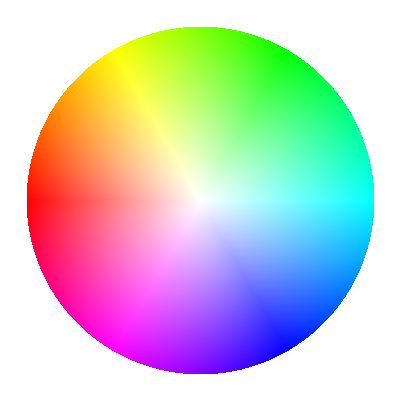

Channels
--------

As explained in :doc:`image`, the default color space of eQuimageLab is sRGB (the color space of most display devices), and the default color model is RGB. The native channels of this color space and model are the red, blue and green components of the image. We may introduce additional "composite" channels that bring specific information about the image (and are functions of the RGB components): the luma, the lightness, the value, the saturation, etc... Most of these composite channels are actually borrowed from the other color spaces and models used by eQuimageLab (CIELab/CIELuv, HSV/HSL...). You can actually work with such composite channels without making explicit conversions to those color spaces and models yourself. This section describes the available channels and their use in eQuimageLab.

Definitions
^^^^^^^^^^^

Luminance, lightness, luma and value
""""""""""""""""""""""""""""""""""""

Our eyes catch the "brightness" or "lightness" of an image more accurately than its colors. Therefore, it can be beneficial, for example, to reduce noise on the lightness more agressively than on the colors, or to preserve lightness when transforming colors.

Yet how bright does an image or pixel look ?

This is a complex question because our eyes are not equally sensitive to the red, blue, and green components of the image. This led to the definition of a *perceptual* lightness :math:`L^*`, defined in the **linear RGB color space** as:

.. math::

  L^* = 116{\rm Y}^{1/3}-16\text{ if }{\rm Y} > 0.008856\text{ else }L^* = 903.3{\rm Y}

where Y is the luminance:

.. math::

  {\rm Y} = 0.2126{\rm lR}+0.7152{\rm lG}+0.0722{\rm lB}

and lR, lG, lB are the linear RGB components of the image. The definitions of Y and :math:`L^*` account for the non-linear and non-homogeneous response of the eyes. They highlight, for example, that we are far more sentitive to green than to red and blue light. Note that :math:`L^*` conventionally ranges within [0, 100] instead of [0, 1]. It is the key component of the CIE color spaces (`CIELab <https://en.wikipedia.org/wiki/CIELAB_color_space>`_ and `CIELuv <https://en.wikipedia.org/wiki/CIELUV>`_).

The method :py:meth:`Image.lightness() <equimagelab.equimage.image_colorspaces.MixinImage.lightness>` returns the normalized lightness :math:`L^*/100` of all pixels of a lRGB or a sRGB image (the latter being converted to lRGB for that purpose).

While :math:`L^*` is the best measure of the brightness of a pixel, it is expensive to compute (since our images usually live in the sRGB color space, whereas :math:`L^*` is defined from the lRGB components). Therefore, alternate, *approximate* measures of the brightness have been introduced:

  - The *luma* of a pixel L = 0.2126R+0.7152G+0.0722B. In the lRGB color space, the luma is the luminance L = Y (but has nothing to do with the lightness !). In the sRGB color space, the luma (which somehow accounts for the non-linear and non-homogeneous response of the eye) is often used as a convenient substitute for the lightness :math:`L\equiv L^*/100` (but is not as accurate). The method :py:meth:`Image.luma() <equimagelab.equimage.image_colorspaces.MixinImage.luma>` returns the luma L of all pixels of an image (calculated from the lRGB or sRGB components depending on the color space). Also, the RGB coefficients of the luma can be tweaked with the :py:func:`set_RGB_luma() <equimagelab.equimage.params.set_RGB_luma>` function (and inquired with :py:func:`get_RGB_luma() <equimagelab.equimage.params.get_RGB_luma>`). Depending on your purposes, it may be more convenient to work with L = (R+G+B)/3.

  - The *HSV value* of a pixel V = max(R, G, B). This is a key component of the HSV color model, but a really poor measure of the lightness ! The method :py:meth:`Image.HSV_value() <equimagelab.equimage.image_colorspaces.MixinImage.HSV_value>` returns the HSV value V of all pixels of an image (available for both RGB and HSV images).

  - The *HSL lightness* of a pixel L' = (max(R, G, B)+min(R, G, B))/2. Despite its name, it is also a poor approximation to the CIE lightness :math:`L^*`. The method :py:meth:`Image.HSL_lightness() <equimagelab.equimage.image_colorspaces.MixinImage.HSL_lightness>` returns the HSL lightness L' of all pixels of an image (available for both RGB and HSL images)

The `HSV and HSL color models <https://en.wikipedia.org/wiki/HSL_and_HSV>`_ were designed for numerical efficiency rather than for perceptual homogeneity and accuracy. They remain, nonetheless, well suited to the saturation of colors.

Chroma and saturation
"""""""""""""""""""""

The *chroma* characterizes the colorfulness of pixel. It is defined in the HSV and HSL color models as C = max(R, G, B)-min(R, G, B). It is indeed zero for grays (as R = G = B), and is maximum (C = 1) when at least one of the RGB components is 1 and an other is 0 [namely, for the brightest red (RGB = 100), yellow (RGB = 110), green (RGB = 010), cyan (RGB = 011), blue (RGB = 001), and magenta (RGB = 101), as well as for all colors interpolating between two successive ones].

The chroma however increases with brightness and does not, therefore, quantify how far the color is *saturated* (i.e., how far the chroma can be further increased at constant brightness). For that purpose, the HSV color model defines a saturation S = C/V = 1-min(R, G, B)/max(R, G, B). S is zero for a gray pixel (RGB = XXX), and S = 1 for pure reds (RGB = X00), yellows (RGB = XX0), greens (RGB = 0X0), cyans (RGB = 0XX), blues (RGB = 00X), magentas (RGB = X0X), and for all colors interpolating between two successive ones. This is best shown on the "HSV wheel of colors" below, where saturation increases from the center (S = 0) to the edges (S = 1) at constant value (here V = 1).

   The "HSV wheel" of colors. Saturation increases from the center to the edge of the wheel.

The saturation is, therefore, a measure of the "strength" of the color relative to its brightness. Decreasing the saturation of a pixel makes it look more grayish, while increasing the saturation makes it look more vivid.

The definition of the saturation is different for the HSL color model, but the spirit is the same. In the CIELab color space, the chroma is defined as :math:`c^*=\sqrt{a^{*2}+b^{*2}}`, and in the CIELuv color space as :math:`c^*=\sqrt{u^{*2}+v^{*2}}`. The saturation is :math:`s^*=c^*/L^*` in the CIELuv color space, but can not be rigorously defined in the CIELab color space (because :math:`c^*\to 0` when :math:`L^*\to 0` in the CIELuv, but not in the CIELab color space).

Usage
^^^^^

Getting and setting channels
""""""""""""""""""""""""""""

The following method of an :py:class:`Image <equimagelab.equimage.image.Image>` object returns an arbitrary (native or composite) channel of the image as a :py:class:`numpy.ndarray`:

.. currentmodule:: equimagelab.equimage.image_colorspaces.MixinImage

.. autosummary::

  get_channel

where ``channel`` can be:

  - "1", "2", "3" (or equivalently "R", "G", "B" for RGB images): The first/second/third channel (all images).
  - "V": The HSV value (RGB, HSV and grayscale images).
  - "S": The HSV saturation (RGB, HSV and grayscale images).
  - "L'": The HSL lightness (RGB, HSL and grayscale images).
  - "S'": The HSL saturation (RGB, HSL and grayscale images).
  - "H": The HSV/HSL hue (RGB, HSV and HSL images).
  - "L": The luma (RGB and grayscale images).
  - "L*": The CIE lightness :math:`L^*` (RGB, grayscale, CIELab and CIELuv images).
  - "c*": The CIE chroma :math:`c^*` (CIELab and CIELuv images).
  - "s*": The CIE saturation :math:`s^*` (CIELuv images).
  - "h*": The CIE hue angle :math:`h^*` (CIELab and CIELuv images).

Alternatively, the following methods of the :py:class:`Image <equimagelab.equimage.image.Image>` class return specific channels:

.. autosummary::

   luma
   luminance
   lightness
   HSX_hue
   HSV_value
   HSV_saturation
   HSL_lightness
   HSL_saturation
   CIE_hue
   CIE_chroma
   CIE_saturation

Moreover, the following functions of eQuimageLab return the luma and lightness of a :py:class:`numpy.ndarray` (or of an :py:class:`Image <equimagelab.equimage.image.Image>` object) containing a RGB image:

.. currentmodule:: equimagelab.equimage.image_colorspaces

.. autosummary::

   luma
   lRGB_lightness
   sRGB_lightness

A native or composite channel of an :py:class:`Image <equimagelab.equimage.image.Image>` object can be updated with the method:

.. currentmodule:: equimagelab.equimage.image_colorspaces.MixinImage

.. autosummary::

   set_channel

Finally, a given transformation can be applied to specific channels of the image with the method:

.. autosummary::

   apply_channels

The last two methods enable, therefore, transformations on composite channels without explicit conversions to other color spaces and models (which are handled internally by eQuimageLab).
Moreover, many transformations implemented in eQuimageLab feature a ``channels`` kwarg that specifies the channels they must be applied to (see :ref:`examples` below).

Histograms and statistics
"""""""""""""""""""""""""

The histograms and statistics of all channels can be computed with the following methods of the :py:class:`Image <equimagelab.equimage.image.Image>` class:

.. currentmodule:: equimagelab.equimage.image_stats.MixinImage

.. autosummary::

   histograms
   statistics

The histograms can be displayed in JupyterLab cells or on the dashboard with the relevant commands (see :doc:`firststeps` and :doc:`dashboard`).

Also see the following functions of eQuimageLab about histograms:

.. currentmodule:: equimagelab

.. autosummary::

   equimage.params.set_max_hist_bins
   equimage.params.set_default_hist_bins

Operations on the luma
""""""""""""""""""""""

Operations on the luma L of an image are designed to preserve the ratios between the RGB components, hence to preserve the hue and saturation (the "apparent" color).

Therefore, stretching the luma protects the colors of the image, whereas stretching the RGB components separately usually tends to "bleach" the image. Stretching the value also protects the colors, but tends to mess up the lightness (see :doc:`image` section).

However, acting on the luma L can bring some RGB components out of the [0, 1] range.

Let us take the midtone transformation T(x) = 0.761x/(0.522x+0.239) as an example (see the :py:meth:`Image.midtone_stretch() <equimagelab.equimage.image_stretch.MixinImage.midtone_stretch>` method). The transformation T(x) maps [0, 1] onto [0, 1] and does not, therefore, produce out-of-range pixels when applied to the R, G, B channels separately.

Let us now consider a pixel with components (R = 0.4, G = 0.2, B = 0.6) and luma L = 0.2126R+0.7152G+0.0722B = 0.271. Under transformation T, the luma of this pixel doubles and becomes L' = T(L) = 0.543. Accordingly, the new RGB components of the pixel are (R' = 0.8, G' = 0.4, B' = 1.2). While L' is still within bounds, B' is not.

Such out-of-range pixels are clipped when displayed or saved in png and tiff files.

There are four options to deal with the out-of-range pixels:

  1. Leave "as is": If you are confident that further processing will bring back these pixels in the [0, 1] range (or are satisfied with the look of the image), you can simply... do nothing about them.

  2. Desaturate at constant luma: decrease the HSV saturation of the out-of-range pixels while keeping the luma constant until all components fall back in the [0, 1] range. This preserves the intent of the stretch (the luma is unchanged, as well as the hue) but tends to bleach the out-of-range pixels. In the present case, the transformed pixel becomes (R' = 0.722, G' = 0.443, B' = 1) and the HSV saturation decreases from S = 0.667 to S' = 0.557.

  3. Blend each out-of-range pixel with (T(R), T(G), T(B)), so that all components fall back in the [0, 1] range. This preserves neither the luma nor the hue & saturation, and also tends to bleach the out-of-range pixels. In the present case, (T(R), T(G), T(B)) = (0.680, 0.443, 0.827) and the transformed pixel becomes (R' = 0.736, G' = 0.423, B' = 1). The output luma is L' = 0.531 and the output HSV saturation is S' = 0.577.

  4. Normalize the image so that all pixels fall back in the [0, 1] range (namely, divide the image by the maximum RGB value). This preserves the hue and saturation, but darkens the whole image.

In eQuimageLab, these four options correspond to different choices for the kwarg ``channels`` of the midtone transformation: 1) ``channels = "L"``, 2) ``channels = "Ls"``, 3) ``channels = "Lb"``, and 4) ``channels = "Ln"``.

.. _examples:

Examples
^^^^^^^^

The following example stretches the luma of the sRGB image *image* while protecting highlights by desaturation:

.. code-block:: ipython3

  stretched = image.midtone_stretch(channels = "Ls", midtone = .2)

The following example increases the HSV saturation of the sRGB image *image* by 50% while preserving its lightness:

.. code-block:: ipython3

  S = image.HSV_saturation() # Get the HSV saturation (or equivalently S = image.get_channel("S")).
  S *= 1.5 # Increase the saturation by 50%.
  saturated = image.set_channel("S", S) # Create a new, saturated image.
  saturated.set_channel("L*", image.lightness(), inplace = True) # Correct the lightness.

Also see :py:meth:`Image.HSX_color_saturation() <equimagelab.equimage.image_colors.MixinImage.HSX_color_saturation>` for a simpler version of this transformation.
