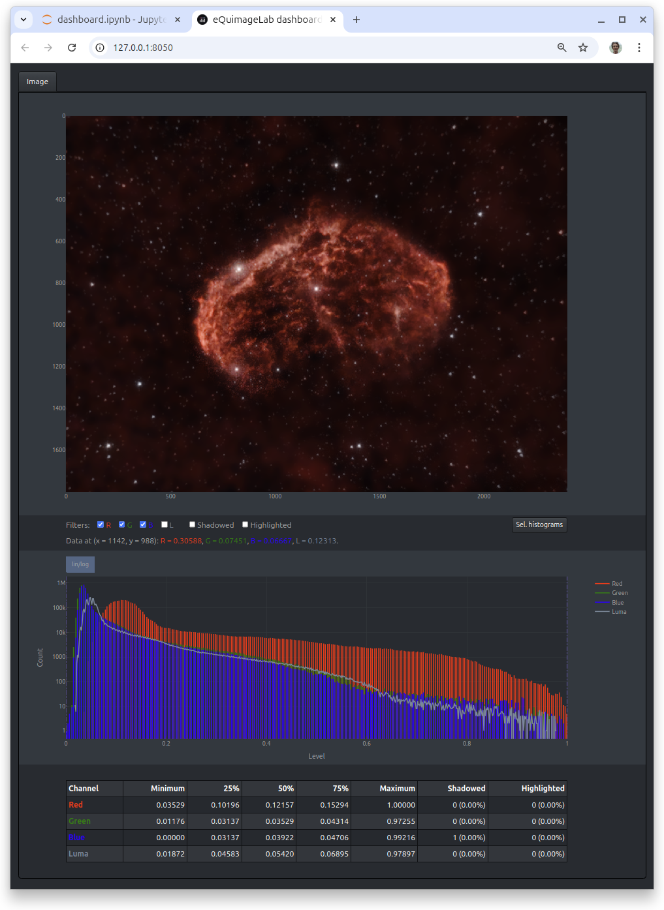

The dashboard
-------------

You can also display images in a separate dashboard managed with `Dash <https://dash.plotly.com/>`_.

Displaying a single image
^^^^^^^^^^^^^^^^^^^^^^^^^

Have a look at this `notebook <notebooks/dashboard.ipynb>`_. This is the same as the previous one, except for

  - The :py:class:`dbrd = eqlab.Dashboard() <equimagelab.jupyter.backend_dash.Dashboard>` line in the first cell that starts the dashboard. This dashboard can be opened in a separate browser tab by clicking on the link provided in the output of the cell.
  - The :py:meth:`dbrd.show(original, histograms = True, statistics = True) <equimagelab.jupyter.backend_dash.Dashboard.show>` instruction in the last cell that displays the image on the dashboard.

You shall now see this on the dashboard:

The "Image" tab displays the image, histograms and statistics. You can zoom in an area of the image or histograms with the mouse (double click to zoom out). A single click on a point of the image displays the data at that point (RGB components, ...).

You can tweak the display with the filter buttons available below the image:

  - *R/G/B*: Include/exclude the red, blue, green component of the image.
  - *Luma*: Display the luma as a grayscale image (see :doc:`composite`).
  - *Shadowed*: Show the black (≤ 0) pixels in orange.
  - *Highlighted*: Show the saturated (≥ 1) pixels in yellow.

You can combine these filters (e.g., *R* + *Shadowed* displays the red component only with the pixels ≤ 0 highlighted in orange).

There is also a *Local histograms* button on the right. This button displays the histograms of the *zoomed area of the image*.

Displaying multiple images
^^^^^^^^^^^^^^^^^^^^^^^^^^

You can display many images at the same time in different tabs of the dashboard, with, e.g., :py:meth:`dbrd.show((transformed, original), histograms = True, statistics = True) <equimagelab.jupyter.backend_dash.Dashboard.show>`. By default, the tabs are labelled "Image" and "Reference" if there are two images (here, *transformed* and *original*, respectively), and "Image #1", "Image #2"... if there are more than two images (but you can change these labels).

Moreover, if there is a "Reference" tab, the filters include a *Difference* button that highlights the differences between the image and this reference in yellow. The *Shadowed* button now shows the black pixels of the image in orange, and those black on both the image and reference in brown. The *Highlighted* button likewise shows the saturated pixels of the image in yellow, and those saturated on both the image and reference in dark yellow. You can thus track the effects of your treatments on the "losses" (black or saturated pixels).

If possible, the zooms in the images are synchronized across tabs to ease comparisons (if you zoom in a tab, this zooms in all tabs).

Here is another example of dashboard with two images and the "Reference" tab shown:

This dashboard is the outcome of :py:meth:`dbrd.show_t(stretched) <equimagelab.jupyter.backend_dash.Dashboard.show_t>`, where *stretched* is the output image of a midtone stretch (see :py:meth:`Image.midtone_stretch <equimagelab.equimage.image_stretch.MixinImage.midtone_stretch>`). The dashboard displays the output, stretched image in the "Image" tab, and the original, input image in the "Reference" tab. Moreover, the histograms panel of the "Reference" tab shows the midtone stretch function *f* (the relation between the input and output RGB levels). You can click on the *f/log f'* button to switch between plots of *f* and *log f'*. The latter is a measure of contrast enhancement as a function of the input RGB level (it is positive when contrast is enhanced, negative when contrast is reduced).

The carousel and before/after slider
^^^^^^^^^^^^^^^^^^^^^^^^^^^^^^^^^^^^

You can also compare two images with a before/after slider using :py:meth:`dbrd.slide(image1, image2) <equimagelab.jupyter.backend_dash.Dashboard.slide>`:

You can finally compare multiple images with a carousel using :py:meth:`dbrd.carousel((image1, image2, ...)) <equimagelab.jupyter.backend_dash.Dashboard.slide>`:

Troubleshooting
^^^^^^^^^^^^^^^

.. hint::

  The dashboard refreshes automatically. If it stops refreshing, click the "reload" button of your browser.

.. warning::

  The dashboard is managed by a Dash application running in background and serving data on port 8050. There can only be one application bound to that port; if you get the error message

  *Address already in use. Port 8050 is in use by another program. Either identify and stop that program, or start the server with a different port.*

  another Dash application (from a previous or concurrent eQuimageLab session) may be running on your machine.

  On Linux or Mac OSX, you can get the process ID (<PID>) of the application bound to port 8050 with the shell command ``lsof -i:8050``, and kill it (if you know what you're doing) with ``kill <PID>``. On Windows, you can likewise ``netstat -aon | find "8050"`` and ``taskkill /PID <PID>`` in a command prompt.

  **To avoid such issues, always quit JupyterLab through the File/Shutdown menu in order not to leave a stale Dash application running in background.**
