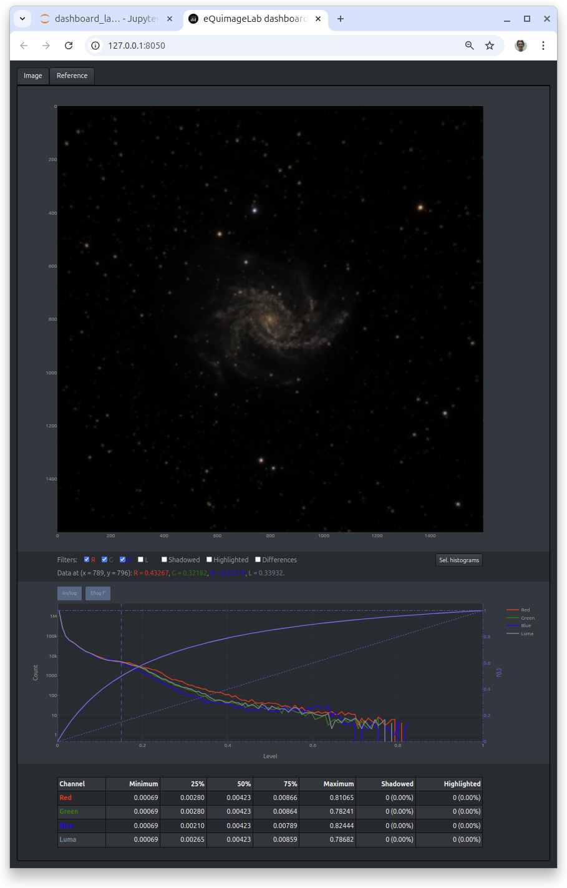
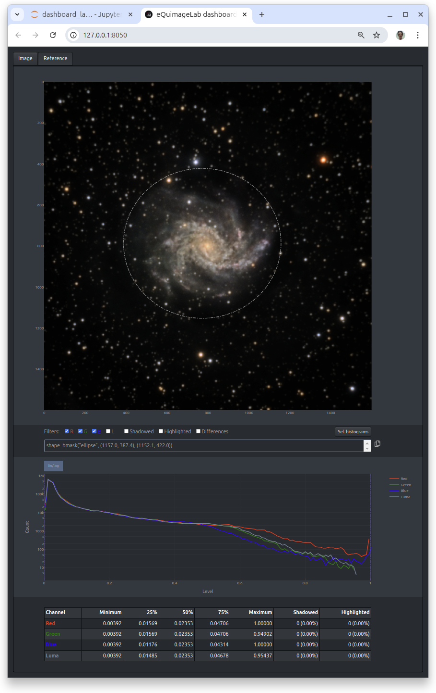
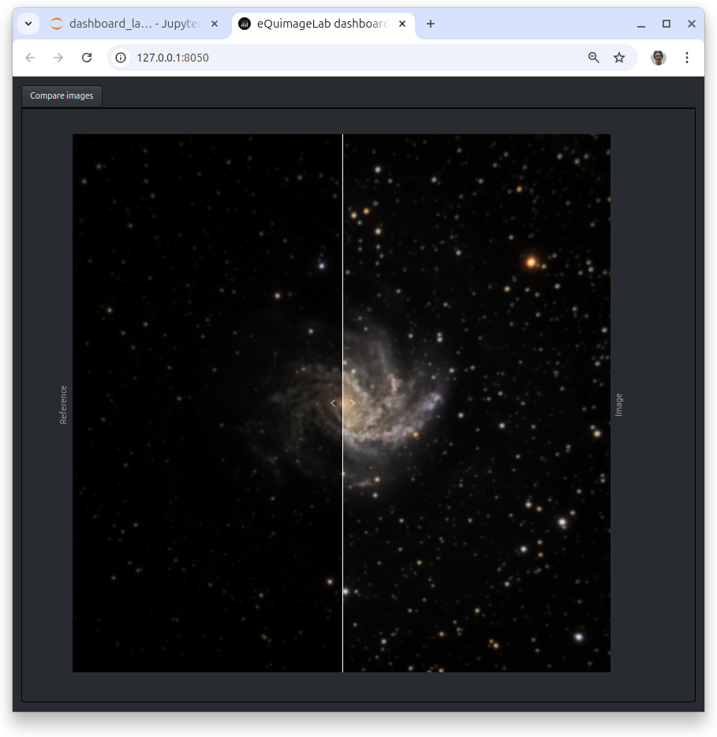
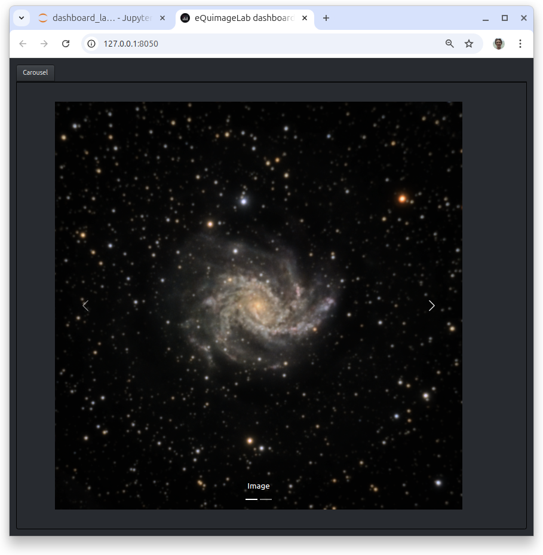

The dashboard
-------------

You can also display images in a separate dashboard managed with `Dash <https://dash.plotly.com/>`_.

Displaying a single image
^^^^^^^^^^^^^^^^^^^^^^^^^

Have a look at this `notebook <notebooks/dashboard.ipynb>`_. This is the same as the previous one, except for

  - The :py:class:`dbrd = eqlab.Dashboard() <equimagelab.jupyter.backend_dash.Dashboard>` line in the first cell that starts the dashboard. This dashboard can be opened in a separate browser tab by clicking on the link (`<http://127.0.0.1:8050>`_) provided in the output of the cell.
  - The :py:meth:`dbrd.show(original, histograms = True, statistics = True) <equimagelab.jupyter.backend_dash.Dashboard.show>` instruction in the last cell that displays the image on the dashboard.

You shall now see this on the dashboard:

.. image:: images/dashboard1.png
   :width: 100%
   :align: center
   :alt: eQuimageLab dashboard

The "Image" tab displays the image, histograms and statistics. You can zoom in the image or histograms with the mouse (double click to zoom out). A single click on a point of the image shows the data at this point (RGB components, ...).

You can filter the display with the buttons available below the image:

  - *R/G/B*: Include/exclude the red, blue, green component of the image.
  - *Luma*: Display the luma as a grayscale image (see :doc:`composite`).
  - *Shadowed*: Show the black (≤ 0) pixels in orange.
  - *Highlighted*: Show the saturated (≥ 1) pixels in yellow.

You may combine these filters (e.g., *R* + *Shadowed* displays the red component only with the pixels ≤ 0 highlighted in orange).

The *Sel. histograms* button on the right shows the histograms of the displayed (zoomed) area of the image or of the selection (if any, see below).

Displaying multiple images
^^^^^^^^^^^^^^^^^^^^^^^^^^

You can display many images at the same time in different tabs of the dashboard, with, e.g., :py:meth:`dbrd.show((transformed, original), histograms = True, statistics = True) <equimagelab.jupyter.backend_dash.Dashboard.show>`. By default, the tabs are labelled "Image" and "Reference" if there are two images (here, *transformed* and *original*, respectively), and "Image #1", "Image #2"... if there are more than two images (but you can change these labels).

Moreover, if there is a "Reference" tab, the filters include a *Difference* button that highlights the differences between an image and this reference in yellow. The *Shadowed* button now shows the black pixels of an image in orange, and those black on both the image and reference in brown. The *Highlighted* button likewise shows the saturated pixels of an image in yellow, and those saturated on both the image and reference in dark yellow. You can thus track the effects of your treatments on the "losses" (black or saturated pixels).

If possible, the zooms in the images are synchronized across tabs to ease comparisons (if you zoom in a tab, this zooms in all tabs).

Here is another example of dashboard with two images and the "Reference" tab shown:

This dashboard is the outcome of :py:meth:`dbrd.show_t(stretched) <equimagelab.jupyter.backend_dash.Dashboard.show_t>`, where *stretched* is the output image of a midtone stretch (see :py:meth:`Image.midtone_stretch() <equimagelab.equimage.image_stretch.MixinImage.midtone_stretch>`). The dashboard displays the output, stretched image in the "Image" tab, and the original, input image in the "Reference" tab. Moreover, the histograms panel of the "Reference" tab shows the midtone stretch function *f* (the relation between the input and output luma L, in purple). You can click on the *f/log f'* button to switch between plots of *f* and *log f'*. The latter is a measure of contrast enhancement as a function of the input luma (it is positive when contrast is enhanced, negative when contrast is reduced).

Selections
^^^^^^^^^^

When the mouse pointer is over an image, the following contextual menu appears on the top right of that image:

.. image:: images/menu.png
   :width: 50%
   :align: center
   :alt: The contextual menu

The items of this menu enable, from left to right :

  - To take a snapshot of the image.
  - To zoom in the image with the mouse (default).
  - To pan the image with the mouse.
  - To make a rectangular selection in the image with the mouse.
  - To make an elliptical selection in the image with the mouse.
  - To make an arbitrary lasso selection in the image with the mouse.
  - To cancel the present selection.
  - To zoom in.
  - To zoom out.
  - To auto-scale the image.
  - To go back to the original view.

When a selection is made, a text box displays a ``shape_bmask(...)`` instruction below the image:

This ``shape_bmask(...)`` instruction can be copied (with the copy icon on the right of the text box) and pasted into the notebook to define a mask corresponding to the selection. For example,

.. code-block:: python

  mask = stretched.shape_bmask("ellipse", (1157.0, 387.4), (1152.1, 422.0))
  selected = np.where(mask, stretched, 0.)

creates a binary mask for the image `stretched`, then uses this mask to set all pixels outside the selection to zero (black). The binary mask is a boolean :py:class:`numpy.ndarray` with the same size as the image, which is True inside the selection and False outside. Here the selection is the ellipse inscribed in the rectangle extending from x = 387.4 to x = 1157.0 and from y = 422.0 to y = 1152.1. That way you won't need to redraw the selection with the mouse if you run the notebook again, as it is now "hardcoded" in Python. For more informations about masks, see :doc:`processing`.

A selection can be modified by clicking on its border then moving the points that define this border. Also, the *Sel. histograms* button displays the histograms of the current selection (or the histograms of the displayed area of the image if there is none).

The carousel and before/after slider
^^^^^^^^^^^^^^^^^^^^^^^^^^^^^^^^^^^^

You can also compare two images with a before/after slider using :py:meth:`dbrd.slider(image1, image2) <equimagelab.jupyter.backend_dash.Dashboard.slider>`:

You can finally compare multiple images with a carousel using :py:meth:`dbrd.carousel((image1, image2, ...)) <equimagelab.jupyter.backend_dash.Dashboard.carousel>`:

Troubleshooting
^^^^^^^^^^^^^^^

.. hint::

  The dashboard refreshes automatically. If it stops refreshing, click the "reload" button of your browser.

.. warning::

  The dashboard is managed by a Dash application running in background and serving data on port 8050. There can only be one application bound to that port; if you get the error message

  *Address already in use. Port 8050 is in use by another program. Either identify and stop that program, or start the server with a different port.*

  another Dash server (from a previous or concurrent eQuimageLab session) may be running on your machine.

  You can then try to start Dash on an other port (8051, 8052...) with ``dbrd = eqlab.Dashboard(port = 8051)``.

  You may also terminate the application bound to port 8050 (if you're sure it is the stale Dash server from a previous session) as follows:

    - On Linux or Mac OSX, get the process ID (<PID>) of the application bound to port 8050 with the shell command ``lsof -i:8050``, and kill it with ``kill <PID>``.
    - On Windows, you can likewise ``netstat -aon | find "8050"`` and ``taskkill /PID <PID>`` in a command prompt.

  **To avoid such issues, always quit JupyterLab through the File/Shutdown menu in order not to leave a stale Dash server running in background.**
