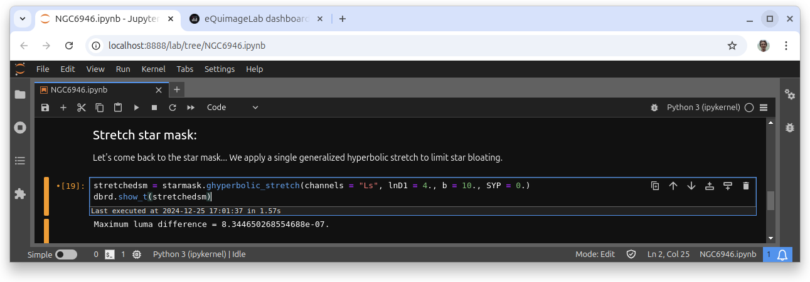

.. eQuimageLab documentation master file, created by
   sphinx-quickstart on Wed Dec 11 08:35:12 2024.
   You can adapt this file completely to your liking, but it should at least
   contain the root `toctree` directive.

eQuimageLab
===========

eQuimageLab is a Python package to process astronomical images in `JupyterLab <https://jupyter.org/>`_ notebooks.

Why use JupyterLab notebooks to process your images ?

  - You can easily modify/add/delete/move any operation in your workflow without the need to manually undo/redo the others.
  - You can tweak your notebook any time (shall you have new ideas to deal with an image) and reprocess in a few minutes.
  - You benefit from the full Python ecosystem to help you make the most out of your images (Numpy, Scikit-image, etc...).
  - ...

| Author: `Yann-Michel Niquet <mailto:ymniquet@ymniquet.fr>`_ (`<https://astro.ymniquet.fr/>`_).
| Do not hesitate to drop a message !

Version of this documentation: |version|.

.. toctree::
   :maxdepth: 2
   :caption: Contents:

   userguide
   api

Latest news:
------------

  - December 15, 2024: Version 1.0.0.
  - December 26, 2024: Version 1.0.1.

    - First complete documentation.

  - January 9, 2025: Version 1.1.0.

    - Float32 & float64 image types.
    - Operations on the lightness :math:`L^*`.
    - Generalized arcsinh, harmonic and power law stretches.
    - Curve stretch.
    - Statistical stretch.
    - Light-dependent blur and sharpen (:py:meth:`LDBS <equimagelab.equimage.image_filters.MixinImage.LDBS>`).

  - February 2, 2025: Version 1.2.0.

    - Rectangle, ellipse & lasso (polygon) selections on the images.
    - Histograms of the selection.
    - Image mask from the selection.
    - Added lightness parameter in :py:meth:`color_saturation <equimagelab.equimage.image_colors.MixinImage.color_saturation>`.

  - Version 1.3.0.

    - HSL color model for lRGB and sRGB color spaces.
    - CIELab color space (with Lab and Lch color models).
    - CIELuv color space (with Luv and Lch color models).
    - Operations on HSL and HSV hue.

